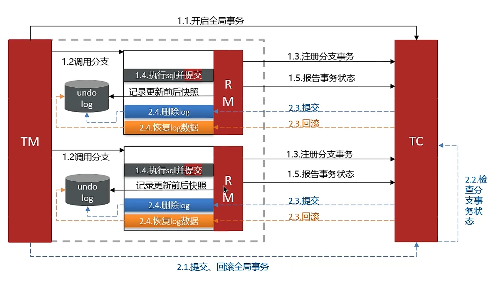

# Java基础
+ io
BIO AIO 异步io
  
## 集合
### HashMap查询删除的时间复杂度
+ 没有冲突的时候 o1
+ 转为链表的时候 on
+ 转为红黑树的时候 ologn

## 线程池的执行原理？
1.提交任务
2.核心线程是否已满 否 创建线程
3.等待队列是否已满 否 进入队列
4.最大线程数是否已满 否 创建线程
5.拒绝策略

## 如何确定核心线程数
+ io密集型任务 2n+1
+ cpu密集型任务 n+1 

## 线程池的种类
+ Executor.newFixedThreadPool 固定线程数
+ Executor.newSingleThreadPool 单个线程
+ Executor.newCacheThreadPool 可缓存线程
+ Executor. newScheduledThreadPool 可以执行延迟任务的线程池

## 多线程使用场景
+ 批量导入 countDownLatch
+ 数据汇总 future get
+ 异步调用 开启异步调用 指定线程池

## threadlocal的理解
1.threadlocal实现了资源对象的线程隔离
2.同时也实现了线程内的资源共享

# JVM
## jvm内存模型

## 堆内存基本结构

## 内存分配原则

+ 对象优先再eden区分配 eden区没有足够空间会进行一次 minjor gc
+ 大对象直接进入老年代 字符串 数组
+ 长期存货对象直接进入老年代

## 虚拟机栈
### 局部变量是否线程安全
+ 如果局部变量没有逃离方法的作用范围是安全的
+ 如果局部变量引用了对象 并逃离了方法的作用范围是不安全的
### 什么情况下会导致栈内存溢出
+ 栈帧过多会导致
+ 递归调用
### 椎栈区别
+ 栈内存存储方法调用和局部变量 堆存对象和数组 堆有gc回收
+ 栈内存是线程私有 堆是共享的
+ oom不同

### 方法区
也是共享的 
+ 存类的信息 和 运行时常量池
+ 虚拟机启动创建 关闭释放
+ oom metaspace

### 直接内存
+ 不属于jvm内存结构 不由jvm管理 系统内存
+ 常见于nio 读写性能高

## 类加载器
+ Bootstrap  加载 /jre/lib下的
+ 拓展类加载器 加载 /jre/ext下的
+ appclssload 加载classpath下的
+ 自定义

### 为什么使用双亲委派
+ 防止重复加载
+ 保证类库不被修改

## 垃圾收集器
+ 串行垃圾收集器   
    + serial 新生代 标记复制算法
    + serial old 老年代 标记整理
    
+ 并行垃圾收集器 1.8 默认
    + parallel new 新生代 标记复制算法
    + parallel old 老年代 标记整理
    
+ cms
  标记清除 针对老年代
  
+ g1 1.9之后默认
  作用老年代新生代  
   + 多个区域 eden s0 s1 大对象准备的区域
   + 采用复制算法
   + 分成三个阶段 新生代回收  并发标记  混合收集

     
## jvm调优的参数可以在哪里设置
+ war包在tomcat /bin/catalina.sh 里配置
+ jar包 启动时设置参数

## jvm调优参数有哪些
+ 设置堆空间大小 -Xms： -Xmx 
  + 最大堆大小设置 物理内存的1/4 初始大小是1/64
  + 堆内存太大 存在 fullgc风险
    
+ 虚拟机栈设置 -Xss 
  默认 1m内存 设置 256k 512k
  
+ 设置eden  surivor 默认 8：1：1

+ 年轻代晋升老年代 默认15

## jvm调优工具有哪些
+ jps 进程状态信息
+ jstack 查看进程内的堆栈信息
+ jmap 查看堆转信息
+ jstat jvm统计检测工具

+ 可视化 
    + jconsole 
    + visualvm
    

## 内存泄露排查问题
+ jmap 和 jvm参数 生产 dump文件
+ visulvm可视化工具导入 dump 文件 找到原因

## 如何解决cpu飙高问题
+ top命令找到进程
+ ps 命令找到线程
+ jstack 查看进程中哪些线程出现问题

## 主要进行gc的区域

### 部分收集 Partial GC

+ 新生代收集:minjor gc ：只对新生代进行垃圾收集
+ 老年代收集:Major GC 只对老年代进行收集
+ 混合收集 mixed gc 对整个新生代和部分老年代进行垃圾收集

### 整堆收集

收集整个 Java 堆和方法区

## 死亡对象判断方法

+ 引用计数法
+ 可达性分析算法

### 哪些对象可以作为 GC Roots 呢？

+ 虚拟机栈(栈帧中的本地变量表)中引用的对象
+ 本地方法栈(Native 方法)中引用的对象
+ 方法区中类静态属性引用的对象
+ 方法区中常量引用的对象
+ 所有被同步锁持有的对象

## 引用类型总结

+ 强引用 不会回收 报出异常
+ 软引用 内存不足会回收
+ 弱引用 不管内存足不足都会回收

## 垃圾收集算法

+ 标记清除
+ 复制算法 为了解决标记清楚会产生内存碎片问题
+ 标记整理 标记过程与标记清楚一样 后续步骤不是直接对可回收对象回收，而是让所有存活的对象向一端移动，然后直接清理掉端边界以外的内存。
+ 分代收集算法

## 垃圾收集器

+ Serial 收集器 Serial OLD 老年代版本 单线程 `新生代采用标记-复制算法，老年代采用标记-整理算法`。
+ ParNew Serial 收集器多线程版本`新生代采用标记-复制算法，老年代采用标记-整理算法`
+ Parallel Scavenge 收集器 Parallel OLD Parallel Scavenge 收集器关注点是吞吐量（高效率的利用 CPU）。CMS
  等垃圾收集器的关注点更多的是用户线程的停顿时间（提高用户体验）`新生代采用标记-复制算法，老年代采用标记-整理算法。` 1.8默认收集器
+ CMS收集器 真正意义上的并发收集器
    - 初始标记
    - 并发标记
    - 重新标记
    - 并发清除
+ G1收集器
    - 初始标记
    - 并发标记
    - 最终标记
    - 筛选回收

## 类加载过程

# Spring & SpringBoot

## 谈谈自己对于 Spring IoC 的了解

IoC（Inversion of Control:控制反转 将创建对象交给容器 ioc容器去管理依赖

+ 控制：指的是对象创建（实例化、管理）的权力
+ 反转：控制权交给外部环境（Spring 框架、IoC 容器）

## Bean的作用域有哪些

- singleton：单例
- prototype：每次get都会新建
- request ：每一个http请求都会新建
- session ：每一个新的session都会新建
- application/global-session 每个 Web 应用在启动时创建一个 Bean
- websocket 每一个websocket会话新建

## 单例 Bean 的线程安全问题了解吗？

+ 在 Bean 中尽量避免定义可变的成员变量。
+ 在类中定义一个 ThreadLocal 成员变量，将需要的可变成员变量保存在 ThreadLocal 中（推荐的一种方式）。

## Bean 的生命周期了解么?

+ Bean 容器找到配置文件中 Spring Bean 的定义。
+ 利用反射创建一个实例
+ 如果涉及到一些属性值 利用 set()方法设置一些属性值。
+ 如果 Bean 实现了 BeanNameAware 接口，调用 setBeanName()方法，传入 Bean 的名字
+ 如果 Bean 实现了 BeanClassLoaderAware 接口，调用 setBeanClassLoader()方法，传入 ClassLoader对象的实例。
+ 如果 Bean 实现了 BeanFactoryAware 接口，调用 setBeanFactory()方法，传入 BeanFactory对象的实例。
+ 与上面的类似，如果实现了其他 *.Aware接口，就调用相应的方法。
+ 如果有和加载这个 Bean 的 Spring 容器相关的 BeanPostProcessor 对象，执行postProcessBeforeInitialization() 方法
+ 如果 Bean 实现了InitializingBean接口，执行afterPropertiesSet()方法。
+ 如果 Bean 在配置文件中的定义包含 init-method 属性，执行指定的方法。
+ 如果有和加载这个 Bean 的 Spring 容器相关的 BeanPostProcessor 对象，执行postProcessAfterInitialization() 方法
+ 当要销毁 Bean 的时候，如果 Bean 实现了 DisposableBean 接口，执行 destroy() 方法。
+ 要销毁 Bean 的时候，如果 Bean 在配置文件中的定义包含 destroy-method 属性，执行指定的方法。

## Spring AOP 和 AspectJ AOP 有什么区别？

Spring AOP 属于运行时增强，而 AspectJ 是编译时增强。

## AspectJ 定义的通知类型有哪些？

+ Before 前置通知
+ After 后置通知
+ AfterReturning 返回通知
+ AfterThrowing 异常通知
+ Around 环绕通知

## 多个切面的执行顺序如何控制？

@Order注解 或者实现 Order接口重写getOrder方法

## Spring MVC 的核心组件有哪些？

+ DispatcherServlet：核心的中央处理器，负责接收请求、分发，并给予客户端响应。
+ HandlerMapping：处理器映射器，根据 uri 去匹配查找能处理的 Handler ，并会将请求涉及到的拦截器
+ HandlerAdapter：处理器适配器，根据 HandlerMapping 找到的 Handler ，适配执行对应的 Handler；
+ Handler：请求处理器，处理实际请求的处理器
+ ViewResolver：视图解析器，根据 Handler 返回的逻辑视图 / 视图，解析并渲染真正的视图，并传递给 DispatcherServlet 响应客户端

## SpringMVC 工作原理了解吗?

## 统一异常怎么做？

+ @ControllerAdvice + @ExceptionHandler

## Spring 框架中用到了哪些设计模式？

+ 工厂设计模式
+ 代理设计模式
+ 单例设计模式
+ 模板方法模式
+ 包装器设计模式 多个数据源
+ 观察者模式: Spring 事件驱动模型就是观察者模式很经典的一个应用。
+ 适配器模式 : Spring AOP 的增强或通知(Advice)使用到了适配器模式、spring MVC 中也是用到了适配器模式适配Controller。

## Spring 事务中哪几种事务传播行为?

+ REQUIRED：如果当前存在事务，则加入该事务；如果当前没有事务，则创建一个新的事务。
+ EQUIRES_NEW 创建一个新的事务，如果当前存在事务，则把当前事务挂起。 开启的事务相互独立，互不干扰
+ NESTED ： 如果当前存在事务，则创建一个事务作为当前事务的嵌套事务来运行；如果当前没有事务，创建事务
+ MANDATORY 如果当前存在事务，则加入该事务；如果当前没有事务，则抛出异常
+ SUPPORTS 如果当前存在事务，则加入该事务；如果当前没有事务，则以非事务的方式继续运行。
+ NOT_SUPPORTED: 以非事务方式运行，如果当前存在事务，则把当前事务挂起。
+ NEVER: 以非事务方式运行，如果当前存在事务，则抛出异常

## Spring 事务中的隔离级别有哪几种?

+ ISOLATION_DEFAULT 用后端数据库默认的隔离级别，MySQL 默认采用的 REPEATABLE_READ 隔离级别 Oracle 默认采用的 READ_COMMITTED 隔离级别.
+ READ_UNCOMMITTED :最低的隔离级别，使用这个隔离级别很少，因为它允许读取尚未提交的数据变更，
+ ISOLATION_READ_COMMITTED : 允许读取并发事务已经提交的数据
+ n.ISOLATION_SERIALIZABLE : 最高的隔离级别，完全服从 ACID 的隔离级别

## Spring事务失效场景

+ 异常捕获处理：
    + 处理方法 在catch将异常抛出

+ 抛出检擦异常
    + 默认只回滚非检查异常
    + 

+ 非public方法导致失效

## Spring BEAN的生命周期

通过BeanDefinition 获取bean的定义信息 1.构造方法 2.依赖注入 3.BeanNameAWare BeanFactoryAWare ApplicationContextAware
4.BeanPostProcessor#Before 5.初始化方法 @PostConstruct 6.BeanPostProcessor#After 7.销毁bean的方法 @PreDestroy

## Spring的循环引用

## 三级缓存解决循环引用

@Lazy注解

## 构造方法出现循环依赖怎么解决

## @SpringBootApplication注解

+ @EnableAutoConfiguration 启动自动配置 AutoConfigurationImportSelector类 加载对象到容器中
+ @ComponentScan 扫描类装配对象
+ @Configuration 允许上下文注册额外的bean 和配置文件

## SpringBoot自动配置原理

## Spring框架常见注解

## Spring Boot 怎么解决远程调用

+ jsonp
+ 后端使用 CORS 一个网站访问另外一个网站 浏览器首先发送一个options请求 根据Access-control-allow-origin头信息是否允许跨域请求， 在spring boot 通过
    - @CrossOrigin允许那些请求跨域
    - 实现webmvcconfigurer接口 重写 addcorsmapper 方法

# Mybatis

## Mybatis执行流程

1.读取mybatis-config.xml配置文件 2.构建SqlSessionFactory 3.会话工厂创建SqlSession 包含sql语句的所有方法 4.操作数据库接口 Executor执行器 负责查询缓存的维护
5.Executor 接口方法中有一个MappedStatement类型的参数 封装参数映射 6.输入参数映射 7.输出结果映射

## Mybatis是否支持延时加载

支持 默认没有开启

## 延迟加载底层原理

1.使用cglib创建目标对象的代理 2.当调用目标方法时 进入拦截器invoke方法 发现目标方法是null值 执行sql查询 3.获取数据以后调用set方法设置属性值，再继续查询目标方法

## mybatis一级缓存二级缓存

+ 一级缓存 ：基于hashmap本地缓存 其存储作用域为session 当session进行flush或者close之后，缓存就会清空 默认打开一级缓存
+ 二级缓存 : 基于namespace 和mapper的作用域起作用 不依赖与sqlsession默认也采用hashmap本地缓存 需要单独开启（一个核心配置 一个mapper映射文件 ）

# Dubbo

## Dubbo核心角色有哪些

+ Container： 服务运行容器，负责加载、运行服务提供者。必须。
+ Provider： 暴露服务的服务提供方，会向注册中心注册自己提供的服务。必须。
+ Consumer： 调用远程服务的服务消费方，会向注册中心订阅自己所需的服务。必须。
+ Registry： 服务注册与发现的注册中心。注册中心会返回服务提供者地址列表给消费者。非必须。
+ Monitor： 统计服务的调用次数和调用时间的监控中心。服务消费者和提供者会定时发送统计数据到监控中心。 非必须

## Dubbo 中的 Invoker 概念了解么？

Invoker 就是 Dubbo 对远程调用的抽象。

## Dubbo 的工作原理了解么？

+ config 配置层：Dubbo 相关的配置。
+ proxy 服务代理层：调用远程方法像调用本地的方法一样简单的一个关键
+ registry 注册中心层：封装服务地址的注册与发现。
+ cluster 路由层：封装多个提供者的路由及负载均衡
+ monitor 监控层：RPC 调用次数和调用时间监控
+ protocol 远程调用层：封装 RPC 调用，
+ exchange 信息交换层：封装请求响应模式，同步转异步
+ transport 网络传输层：抽象 mina 和 netty 为统一接口
+ serialize 数据序列化层：对需要在网络传输的数据进行序列化。

## Dubbo 提供的负载均衡策略有哪些？

+ RandomLoadBalance 根据权重随机选择（对加权随机算法的实现）。这是 Dubbo 默认采用的一种负载均衡策略。
+ LeastActiveLoadBalance 最小活跃数负载均衡
+ ConsistentHashLoadBalance 一致性 Hash 负载均衡策略
+ RoundRobinLoadBalance 加权轮询负载均衡

## Dubbo 支持哪些序列化方式呢？

JDK 自带的序列化、hessian2、JSON、Kryo、FST、Protostuff，ProtoBu

# Rabbitmq

## 交换机类型

+ fanout
+ direct
+ topic
+ headers

## 什么是死信队列？如何导致的？

+ 消息被拒
+ 消息 TTL 过期
+ 队列满了，无法再添加。

## 什么是延迟队列？RabbitMQ 怎么实现延迟队列？

+ rabbitmq-delayed-message-exchange

## 优先级队列

通过x-max-priority

## 如何保证消息的可靠性？

+ 生产者到 RabbitMQ：事务机制和 Confirm 机制，注意：事务机制和 Confirm 机制是互斥的，两者不能共存，会导致 RabbitMQ 报错。
+ RabbitMQ 自身：持久化
+ RabbitMQ 到消费者：basicAck 机制

## 如何保证 RabbitMQ 消息的顺序性？

+ 拆分多个 queue(消息队列)，每个 queue(消息队列) 一个 consumer(消费者)，
+

# SpringCloud

## SpringCloud5大组件

+ 注册中心: eureka nacos
+ 负载均衡: ribbon
+ 远程调用: feign
+ 服务熔断: hystrix 服务熔断
+ 网关：网关

## Eureka注册发现

+ 服务注册：服务提供者将信息注册到eureka，由eureka来保存这些信息 比如服务名称 ip 端口等等
+ 服务发现：消费者向eureka拉取服务列表信息，如果服务有集群 则消费者会利用负载均衡算法选择其中一个调用
+ 心跳机制：服务提供者每30秒向eureka发送给心跳 报告健康状态 如果eureka90秒没有接收到心跳 从eureka中剔除

## nacos与eureka区别

+ 共同点
    + 都支持服务注册与发现
    + 都支持服务提供者心跳方式检测健康状态

+ 不同点
    + nacos支持服务端主动检测提供者状态，临时实例采用心跳，非临时实例采用主动检测
    + 临时实例心跳不正常会剔除，非临时实例不会
    + nacos 支持服务列表变更为消息推送模式 服务列表更新更及时
    + nacos默认采用ap，当集群存在非临时实例时 采用cp模式，eureka采用 ap

+ nacos还支持 配置中心 eureka只有注册中心

## Rabbion负载均衡策略有哪些

+ 简单轮询
+ 按照权重选择服务器，响应时间越长 权重越小
+ 随机选择一个服务器
+ 忽略那些短路的服务器，选择并发数小的服务器
+ 重试机制选择 还是会简单轮询 会重试
+ 可用性敏感策略 先过滤非健康的 在选择连接数比较小的服务器
+ 以区域可用的服务器为基础进行服务器选择

### 自定义负载均衡策略

创建类实现IRule接口

## 什么是服务雪崩？怎么解决

+ 服务雪崩：一个服务失败 导致整个链路的服务都失败的情形
+ 服务降级：服务自我保护的一种方式 一般开发中使用feign接口整合 编写降级逻辑
+ 服务熔断：默认关闭需要手动打开 如果检测到10秒内请求失败率超过50 出发熔断机制 之后每隔5秒重新尝试请求微服务 如果微服务不能响应 继续走熔断机制 如果响应关闭熔断机制

## 你们的微服务怎么做监控的？

+ skywalking
  

1.skywalking主要可以做监控接口 服务 实例 的一些状态 可以在压测的时候看到众多服务中那些 服务接口比较慢 2.skywalking 设置了告警规则 服务上线出错可以设置给负责人发送短信和邮件

## 限流操作

+ tomcat设置最大链接数
  

+ nginx:
    + 漏桶算法 控制速率
      

    + 控制并发连接数 限制单个ip连接数目

+ 网关限流 ：
    + Spring gateway 中支持局部RequestRateLimiter 来做限流 使用令牌桶算法

    + 可以根据ip或路径进行限流
    + 令牌桶算法
      

## 分布式系统理论

+ CAP
    + 一致性 任意节点数据必须一样
    + 可用性 请求必须得到响应
    + 分区容错性
+ BASE
    + 基本可用
    + 软状态： 在一定时间内允许临时不一致状态
    + 最终一致性 最终数据一致

+ 最终一致性思想：各个分支事物分别执行并提交 如果有不一致的情况 在想办法恢复数据
+ 强一致性思想：各个分支事务执行完业务不要提交 等待彼此结果 然后 统一提交或者回滚

## 分布式事务

+ Seata
    + TC 开启全局事务 提交或者回滚
    + TM :全局事务 服务发起者
    + RM ：分支事务 每一个微服务

    + XA模式
      
    + AT模式
      
    + TCC模式 代码完成
      
+ Mq
    + 异步
    + 最终一致性没有强一致性
  
## 分布式系统接口幂等性如何设置
+ 唯一索引 新增
+ token+redis 新增 修改
+ 分布式锁 新增 修改 

## Nacos注册中心原理

+ 注册前
    - 客户端，即我们的微服务启动时，会将服务的ip，端口等信息封装成一个instance实例对象，准备向Nacos服务端注册
    - ，并创建一个定时的心跳连接机制
    - 隔一段时间都会向Nacos服务端发送PUT请求，Nacos服务端在接收到心跳请求后，会检查当前服务列表是否有这个服务实例，如果有，则刷新该实例的心跳时间，如果没有的话，Nacos服务端开始创建实例。
+ 注册中
    - 在Nacos服务端接收到心跳请求后，会使用Post请求将客户端相关的实例对象信息注册进Nacos服务端
    - 然后服务端将这个服务信息存储进服务端中一个叫ConcurrentHashMap的数组
    - 如果心跳机制超过15秒，服务状态为不健康，超过30秒，这个实例直接被删除。
+ 注册后
    - 在服务注册成功后，客户端会通过定时心跳任务来从服务端获取信息并存储进本地缓存，然后刷新该服务实例的心跳时间。服务端在接收到心跳后，会定时向客户端推送相关的数据给客户端，一般来说是10秒推送一次。

## Nacos配置中心原理

1. 当配置人员在Nacos里修改配置时，Nacos会将配置信息更新并存储到相应的数据库里
2. 我们的服务注册到Nacos时，其实是有一个定时心跳任务的，它每10秒会向Nacos发送心跳信息并获取相对应的配置数据。
3. 客户端获取到服务端的配置信息时，会比较配置信息的MD5数据，当获取到的MD5数据与客户端本地缓存的数据不匹配时，客户端则会重新从服务端来获取新的配置信息并将它缓存在客户端的本地缓存中。

## Ribbon负载均衡策略

+ 轮询策略
+ 权重策略
+ 随机策略
+ 最小连接数策略
+ 重试策略
+ 可用性敏感策略
+ 区域敏感策略

# Redis

## 怎么保持数据一致性

+ 更新数据库时更新缓存
    + 删除缓存还是更新缓存？
        + 更新缓存：每次更新都更新缓存 无效写操作较多
        + 删除缓存：更新数据库让缓存失效，查询在更新缓存 ===
    + 如何保证缓存与数据库的操作同时成功或者失败？
        + 单体系统：操作缓存和数据库放在一个事务中
        + 分布式系统：利用Tcc等分布式事务方案
    + 先操作缓存还是先操作数据库？
        + 先删除缓存在操作数据库
        + 先操作数据库在删除缓存

+ 将缓存和数据库整合为一个服务，由无服务来维护一致性
+ 调用者只关心缓存，然后异步将缓存数据持久化到数据库最终保持一致性

## 缓存穿透

+ 缓存空对象：实现简单 额外内存消耗 可能出现短期不一致
+ 布隆过滤器 在客户端和redis中间加布隆过滤器
    + 内存占用少 没有多余key
    + 实现复杂 bitmap 布隆过滤实现 不一定准确

## 缓存雪崩

+ 大量key同时过期 或者redis挂了
    + ttl过期时间随机
    + 利用redis集群
    + 缓存业务添加降级限流策略
    + 给业务添加多级缓存

## 缓存击穿 & 热点key问题

+ 高并发访问 缓存重建比较复杂
    + 互斥锁
    + 逻辑过期 存储数据的时候加一个过期字段 过期时间

## 如何保证双写一致性

+ 一致性高
    + 读操作：缓存命中直接返回 未命中 查数据库 写入缓存 设置超时时间
    + 写操作：延迟双删除
        + 读写锁 readlock writeLock

+ 一致性不高
    + 异步通知保证数据最终一致性 mq 监听消息去更新缓存
    + 基于canal异步通知 代码 0 嵌入

## redis持久化

+ RDB 当前数据记录到磁盘 redis故障重启后 从磁盘读取数据
    + save bgsave
    + RDB执行原理 ：主进程有一个页表记录了记录了物理内存的数据映射 开启子进程 会复制一个页表 子进程也能读取数据了
    + fork 采用的是copy-on-write 把数据标记为read-only 主进程写操作会拷贝数据副本 进行写操作

+ AOF 追加文件 记录redis的所有写操作
    + 记录频率配置
        + always 同步刷盘 几乎不丢数据
        + everysec 每秒刷盘 最多丢失一秒数据
        + no 操作系统控制 性能最好 可能丢失大量数据
    + 可以执行bgrewriteaof 执行aof重写命令
    + 也可以配置处罚阈值 aof比上次文件增长百分比 或者 aop文件最小多大以上

## 数据删除策略

+惰性删除 ：get时候会检查key是否过期 +定期删除： 每隔一段时间删除过期key

+ slow 模式 ： 执行频率是10hz 每次不超过25ms
+ fast模式：执行频率不固定
+ 配合使用

## 数据淘汰策略

+ noeviction：不淘汰任何key 满了不写入 默认
+ volatile-ttl ：对设置了ttl的key 比较key剩余ttl值 值越小越容易被淘汰
+ allkeys-random：所有key 随机淘汰
+ volatile-random:过期时间key 随机淘汰
+ **allkeys-lru** : 对全体key基于lru 算法淘汰
+ volatile-lru：对设置过期时间key lru淘汰
+ allkeys-lfu：所有key 用lfu算法淘汰
+ volatile-lfu：所有过期时间 lfu算法

### 数据库1000w数据 redis 20w 数据 如何保证redis中的数据都是热点数据？

allkeys-lfu

## 分布式锁

### 如何有效控制锁的有效时长

+根据业务时间设置 +给锁续期：开启线程监控执行业务的时长 redission

### redisson 执行流程

+ redission 分布式锁 可重入
  
  

### redisson 分布式锁重入原理

### redisson锁主从一致性

+ redisson 红锁 在创建redis节点数一半创建锁
+ zookeeper 强一致性

## redis集群有那些方案

+ 主从复制
  
  ### 主从复制同步原理
    + 主从全量同步： 1.salve执行replicaof命令建立连接 2.请求数据同步 3.判断是否第一次同步 4.第一次返回master数据版本信息 5.slave保存信息 6.master 执行bgsave生成rdb
      会生成一个日志文件记录数据 7.发送rdb 8.slave保存rdb

    + 增量同步： 1.salve发送 id 跟offset 2.master判断id是否一致 3.一致继续 4.去日志文件读取offset后的数据 7.发送offset 8.salve执行命令
+ 哨兵模式
  ## 哨兵作用
    + 监控
    + 自动故障回复
    + 通知
      ### redis脑裂如何解决
        + 修改redis的配置 最小从节点数 和主从复制同步时间 达不到要求拒绝请求

+ 分片集群

## reids单线程为什么还那么快？

+ redis是纯内存操作
+ 采用单线程避免上下文切换
+ 使用io多路复用模型
    + 利用单个线程监听多个socket 在某个socket 可读可写通知 从而避免无效等待
    + select 和poll只会通知有socket就绪
    + epoll则会讲就绪的socket写入用户空间

## redis6.0之后使用多线程模型

+ 多线程处理回复事件
+ 多线程命令转换
+ 命令执行是单线程

# Mysql

## 如何定位慢查询

+ 聚合查询
+ 多表查询
+ 表数据量过大查询
+ 深度分页查询

+ 方案一 开源工具
    + arthas
    + 运维工具 skywalking
+ 方案二 mysql自带慢日志查询
    + 开启慢查询日志
        + show_query_log = 1
        + long_query_time = 2

## 一个sql很慢如何分析

+ Explain关键字
  
    + possible_key 可能用到索引
    + key 实际用到索引
    + key_len 索引占用大小
    + Extra 额外优化建议
        + use where use index 索引里都有 不需要回表查询
        + use index condition 用到索引但回表查询了
    + type sql的链接类型: 性能由好到差 null system const eq_ref ref range index all
        + null ：没有用到表
        + system： 用到mysql自带的表
        + const: 更具主键索引查询
        + eq_ref : 更具主键索引或者唯一索引查询
        + ref: 其他索引查询
        + range ： 走索引 是范围查询
        + index ： 索引树扫描
        + all：全盘扫描

## 索引的数据结构

+ 二叉树
  

+红黑树 保证平衡

+ b-树
  

+ b+树：非叶子节点只存储指针 叶子节点存储数据 +阶数更多 路径更短
    + 磁盘读写代价更低
    + 便于扫库和区间查询 叶子节点是一个双向链表
      

## 什么是聚簇索引 非聚簇索引 （聚集索引 二级索引）

+ 聚簇索引 数据存储与索引放到一块 索引的叶子节点保存了行数据 只有一个
+ 非聚簇索引： 分开存储 索引结构的叶子节点关联对应的主键 可以存在多个

    + 聚簇索引选取规则：
        + 如果存在主键 主键就是聚簇索引
        + 如果不存在主键 使用第一个唯一索引作为聚簇索引
        + 如果表没有主键或者没有 唯一索引 innodb会自动生产一个rowid作为聚簇索引

## 什么是回表查询

+ 先从二级索引拿到主键值 再到 聚簇索引中拿到整条数据

## 什么是覆盖索引

+ 覆盖索引不需要回表查询 非覆盖索引要回表查询

## 超大分页怎么处理

+ 覆盖索引加子查询

## 索引创建原则

+ 针对数据量较大 且查询比较频繁 单表数据超过10w ==
+ 针对常做查询条件where ordey by group by 操作的字段做索引 ==
+ 尽量使用区分度高的字段做索引，尽量使用唯一索引 区分度越高索引的效率越高
+ 如果字段的长度比较长 可以建立前缀索引
+ 尽量使用联合索引 减少单列索引 避免回表查询 ==
+ 控制索引数量 ==
+ 如果索引列不能包含null 创建表用not null约束 查询优化器可以更好的确定索引

## 什么情况下索引会失效

1.违反最左前缀法则 从最左前列开始 不能跳过索引列 若跳过只有最左列索引生效 2.范围查询右边的列不能够使用索引 3.不要在索引列上使用运算操作 4.字符串不加单引号 5.%开头模糊查询失效

## sql优化经验

+ 表的设计优化 参考阿里嵩山手册
    + 选择合适的字段值
+ 索引优化

+ sql优化
    + 避免select *
    + union all 代替 union，union会多做一次过滤
    + 不要在操作字段上进行表达式操作
    + 以小表为驱动
+ 主从复制 读写分离
+ 分库分表

## mysql事务

### 事务的特性是什么

+ ACID 原子性 隔离性 一致性 持久性

### 并发事务问题

+ 脏读 ： 一个事务读取了另一个事务没有提交的数据
+ 不可重复读：一个事务先后读取的数据不同
+ 幻读：一个事务查询数据时 没有对应的数据行 但插入的数据发现数据已经存在了

### 事务隔离级别

### undolog 和 redolog的区别

+ redo log 记录数据页的物理变化 服务宕机可以用来同步数据
+ undo log 记录逻辑日志，事务回滚 通过逆操作来恢复原来的数据
+ redo log 保证事务的持久性 undo log 保证事务的原子性跟一致性

### 解释一下mvvc

+ 锁 跟 mvvc
+ mvvc
    + 隐式字段
        + db_trx_id : 最近修改事务id
        + db_roll_ptr :回滚指针 指向这个数据的上一个版本
        + db_row_id: 表没有主键会生成
    + undo log ：回滚日志
    + readview ： 快照读sql执行时mvcc提取数据的依据 记录并维护系统当前活跃的事务id 简单来讲 控制各个事务之间的可见性
        + 当前读：读取时保证其他事务不能修改当前记录 会对读取的记录进行加锁 select - for update，update insert delete
        + 快照读：简单 select

## mysql主从同步原理

+ bin log 日志 ；记录ddl dml 语句 不包括select show

+ master 主库在事务提交时 会把数据记录在二进制日志文件binlog中
+ 从库读取主库的binlog写入到从库的中继日志relay log
+ 从库重做中继日志中的事件 变为自己的数据

## 分库分表

+ 单表的数据达到1000w
+ 优化解决不了性能问题 主从读写分离 查询索引

### 拆分策略

+ 垂直
    + 分库 以表为依据 不同表分到不同数据库中
    + 分表 以字段为依据 根据字段属性将不同字段分到不同表中
+ 水平
    + 分库 一个库数据拆到不同库中
    + 分表 一个表数据拆到不同表中

+ sharding-sphere
+ mycat

# Rabbitmq
## 如何保证消息不丢失
+ 第一个是开启生产者确认机制
+ 第二个是开启持久化功能
+ 第三个是消费者开启 确认机制为 auto 由 spring确认消息处理成功后完成ack  设置 重试次数 例如三次 如果三次没有成功就将失败后的消息转到异常交换机

## 如何解决消息重复消费 
+ 生产者生产消息生产uuid 
+ 消费者消费完消息在redis设置一个uuid
下次再来判断 uuid是否存在 
  
+ 也可以借助数据库锁

## 死性交换机 和 ttl 延迟队列插件

## rabbitmq 由 100w消息堆积在mq 怎么解决
+ 提高消费者能力
+ 增加消费者个数
+ 扩大队列容积

# 企业场景
## 单点登录怎么实现
+ 单体 单个tomcat服务session可以共享
+ 分布式 
    + jwt
      + 用户访问其他系统 会在网关判断token是否有效
      + token无效返回401 转到登录页面
      + 用户发起登录请求 登录成功返回token 浏览器把token 保存到cookie中
      + 浏览器访问其他服务会携带token
    + oauth2
    + cas
    
## shiro
+ RBAC ： 基于角色访问控制
+ 五张表： 用户表  角色表 权限表 用户角色中间表 角色权限中间表
+ 权限框架：

## 上传数据安全性怎么控制
+ 对称加密 或者非对称加密

+ 对称加密 加密解密用同一个密钥
+ 非对称加密  公开密钥  私有密钥 

## 棘手问题怎么解决
+ 设计模式
+ 线上bug
+ sql调优
+ 组件封装

## 日志怎么采集的
+ elk ：es logstash kibana 
+ 

## 生产环境问题怎么排查
+ 分析日志
+ 远程debug

# 怎么快速定位系统瓶颈
+ 压测 
+ 监控
+ 线上诊断工具 arthas

    
# 设计模式
创建型 行为型  结构型
+ 工厂模式 解耦合
  + 简单工厂模式 通过工厂创建对象 违反开闭原则
  + 工厂方法设计模式 针对同一个对象 
  + 抽象工厂模式
  
+ 策略模式
  + 抽象策略
  + 具体策略
  + 环境类 给客户调用
  
+责任链设计模式

  

  
#项目遇到问题

+ 数据汇聚
  + 本地维护一个list 查询华数好服务小程序的用户埋点数据
  + 会报一个oom
  + 采用分页思想
  
+ 应用产品服务能力平台产品压测的时候屏列表数据不一致
+ 读的时候先查缓存后查数据库
+ 写的时候更新数据库 在删除缓存

  
  

