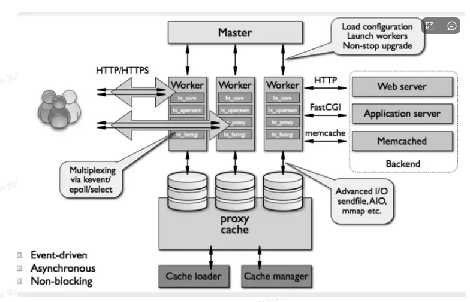

# nginx

## nginx 可以用来作什么
+ 反向代理
+ 正向代理
+ 负载均衡

## nginx有哪些负载均衡策略

+ 轮询
+ ip哈希
+ 最小连接数

## nginx性能优化方式

+ 设置nginx运行工作进程数
+ 开启gzip压缩
+ 设置单个worker进程允许客户端最大连接数
+ 设置超时时间
+ 设置缓存

## nginx如何实现后端服务检查

upstream_check_module

## 如何保证nginx的高可用
+ nginx + keepalived
1.准备两台nginx一台为主服务一台为备用服务
2.分别安装配置keepalived
3.为两台nginx服务绑定同一个虚拟ip
4.编写nginx检测脚本通过keepalived检测nginx主服务是否正常

## nginx的架构
